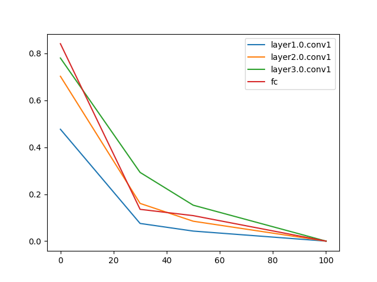

# CCA.pytorch

PyTorch implementation of 
* [**SVCCA: Singular Vector Canonical Correlation Analysis for Deep Learning Dynamics and Interpretability**](https://arxiv.org/abs/1706.05806) 
* [**Insights on representational similarity in neural networks with canonical correlation**](https://arxiv.org/abs/1806.05759)

**Now GPU is set as the default device for SVD calculation.**

# Requirements

* Python>=3.6
* PyTorch>=0.4.1
* torchvision>=0.2.1

To run `example.py`, you also need

* [homura](https://github.com/moskomule/homura)
* matplotlib

# Usage

```python
from cca import CCAHook
device = "cuda" # or "cpu"
hook1 = CCAHook(model, "layer3.0.conv1", svd_device=device)
hook2 = CCAHook(model, "layer3.0.conv2", svd_device=device)
model.eval()
with torch.no_grad():
    model(torch.randn(1200, 3, 224, 224))
hook1.distance(hook2, size=8) # resize to 8x8
```

# Example

`python example.py` trains ResNet-20 on CIFAR-10 for 100 epochs then measures CCA distance between a trained model and its checkpoints.



# Note

While the original SVCCA uses DFT for resizing, we use global average pooling for simplicity.